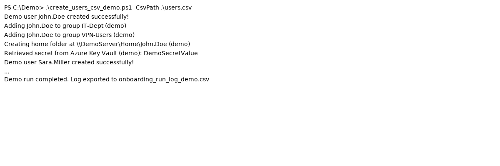
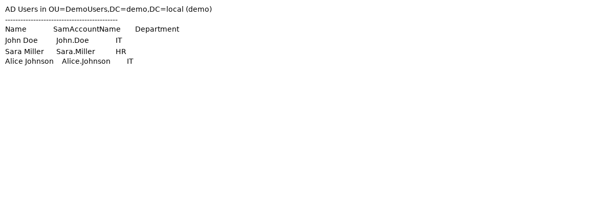

# 🖥️ Active Directory User Automation Demo (PowerShell)

[](https://github.com/)

**Project by Shehryar Hassan ** – Senior IT Support / 3rd-Line Infrastructure Engineer  

---

## 🚀 Project Overview

This project demonstrates **Enterprise-style Active Directory automation** using PowerShell, designed for **senior IT engineers**.  

It simulates real-world tasks that a 3rd-line IT support engineer would handle, including:  

- ✅ Bulk user onboarding via CSV  
- ✅ Active Directory group assignments  
- ✅ Home folder provisioning  
- ✅ Secure password generation (demo-only)  
- ✅ Logging and error handling  
- ✅ Mock Azure Key Vault integration for secret management  
- ⚠️ *Demo only — no real domain or server required*

This is a **safe, fully offline demonstration** suitable for showcasing technical skills to recruiters and hiring managers.  

---

## 📁 Project Structure

```
AD-User-Automation-Demo/
├── create_user_basic_demo.ps1      # Single-user onboarding demo
├── create_users_csv_demo.ps1       # CSV-driven bulk onboarding demo
├── users.csv                        # Example CSV input
├── onboarding_run_log_demo.csv      # Example run log
├── sample_screenshots/              # Mock PowerShell output & AD view
├── README.md                        # This file
├── .gitignore                        # Ignore logs, temp files, screenshots
└── LICENSE                           # MIT License
```

---

## 🛠️ Key Features & Skills Demonstrated

| Feature | Real-World Skill |
|---------|----------------|
| CSV-driven user creation | Automating repetitive AD tasks at scale |
| Group assignments & permissions | Security & access control |
| Home folder provisioning | File server & storage management |
| Secure random password generation | Identity management & security |
| Logging & error handling | Troubleshooting & IT operations best practices |
| Azure Key Vault integration (mocked) | Cloud security & secret management |
| Demo-only environment | Safe, showcase-ready, no production risks |

> These are exactly the types of tasks **3rd-line engineers** handle daily.

---

## ⚡ Demo Usage

### 1️⃣ Single User (Basic Demo)
```powershell
.\create_user_basic_demo.ps1 -FirstName "Alice" -LastName "Johnson"
```
- Generates a **demo user** in the fake domain `demo.local`  
- Generates a **secure random password**  
- Simulates Azure Key Vault secret retrieval  
- Fully offline — no real AD required  

---

### 2️⃣ Bulk Users (CSV-Driven Demo)
```powershell
.\create_users_csv_demo.ps1 -CsvPath ".\users.csv"
```
- Reads `users.csv` with fields:  
  `FirstName,LastName,Department,Groups`  
- Creates multiple demo users  
- Simulates group assignments & home folder creation  
- Logs all actions in `onboarding_run_log_demo.csv`  
- Includes **demo Azure Key Vault secret retrieval**  

**Example `users.csv`:**
```csv
FirstName,LastName,Department,Groups
John,Doe,IT,"IT-Dept;VPN-Users"
Sara,Miller,HR,"HR-Dept"
Alice,Johnson,IT,"IT-Dept;VPN-Users"
```

---

## 📝 Screenshots (Demo Mode)

**PowerShell Run Output**  



**Active Directory User List (Demo)**  



---

## 🔐 Security & Best Practices
- Demo scripts generate **random secure passwords**  
- Logging demonstrates **audit and compliance practices**  
- Error handling mimics real-world troubleshooting scenarios  
- Mock Azure Key Vault integration highlights **cloud security awareness**  
- All scripts are **safe to run locally**, no production systems involved  

---

## 💡 Why This Project Shows Senior-Level Skills

- Demonstrates **automation mindset**, a hallmark of 3rd-line support engineers  
- Simulates **enterprise AD operations** without needing access to a live environment  
- Shows understanding of **security, identity, and compliance**  
- Illustrates ability to **document and present technical projects professionally**  

---

## 📄 License

MIT License – see `LICENSE` file.
